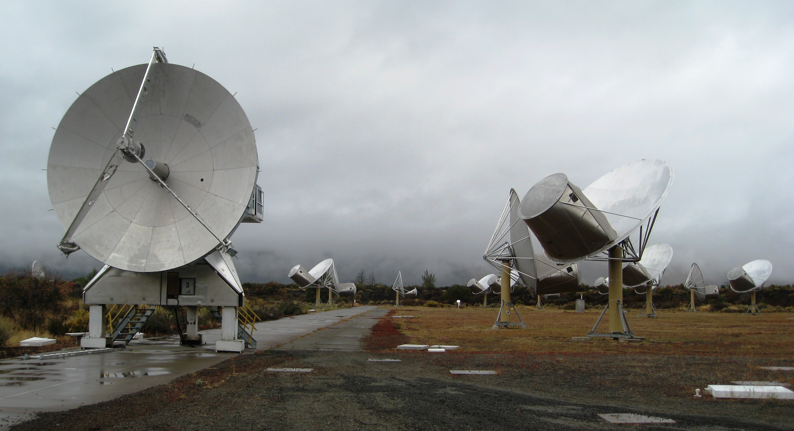

# Classify_Radio_Signals_from_Outer_Space

<h3>There are various faint radio signals emitted in the outer space.To make understanding them easier we can classify them into 4 categories.We treat the signals as images in the form of 2D spectrograms.The data consists of 2D spectrograms of deep space radio signals collected by the Allen Telescope Array at the SETI(Search for Extra terrestrial Intelligence) Institute. treated the spectrograms as images to train an image classification model to classify the signals into one of four classes.</h3>
